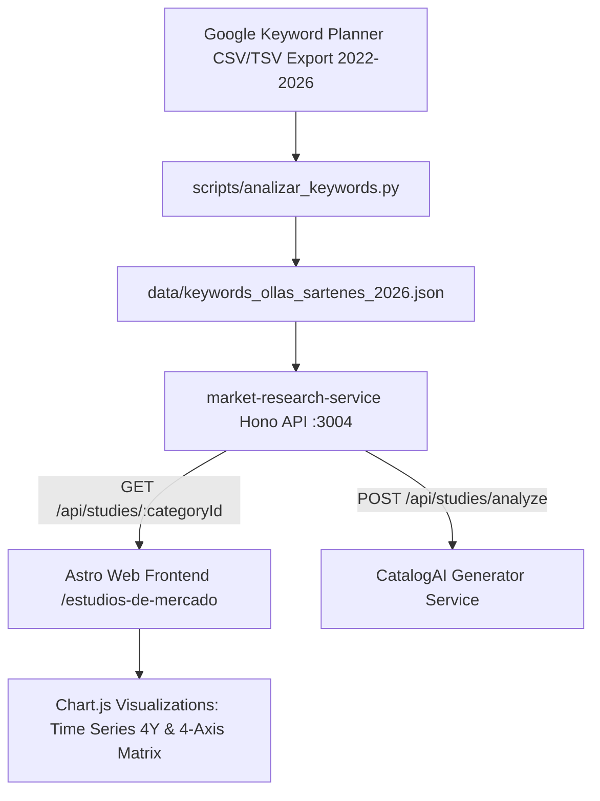

# 📖 Advantia Market Research Service — Arquitectura & Especificación Técnica

Este documento detalla la arquitectura de software, los modelos de datos, los algoritmos de clasificación semántica de 4 ejes y las integraciones del microservicio `market-research-service` (Puerto `3004`).

---

## 🏛️ Arquitectura del Servicio



---

## 📊 Modelo de Datos (TypeScript Data Models)

```typescript
export interface KeywordItem {
  keyword: string;
  volume: number;
  yoy: string;
  competition: 'Alto' | 'Medio' | 'Bajo';
  cluster?: 'presion' | 'arroceras' | 'baterias' | 'multifuncional' | 'hierro' | 'salud' | 'sartenes';
  intent?: 'general' | 'especifico' | 'informacional' | 'quickwin';
  timeSeries?: Array<{
    month: string; // e.g. "Sep 2022", "Aug 2026"
    searches: number;
  }>;
}

export interface StudyMetadata {
  id: string;
  category: string;
  market: string;
  totalKeywords: number;
  totalVolume: number;
  period: string;
  lastUpdated: string;
}
```

---

## 🧮 Algoritmos de Clasificación Semántica

### 1. Clasificador de Intención Comercial (`intent`)
- **Quick Win (`quickwin`):** Se asigna cuando `yoy >= +50%` y el volumen mensual es accesible para ganar posicionamiento rápido.
- **Específico / Marca (`especifico`):** Coincidencia con nombres de fabricantes líderes (*Imusa, Universal, Royal Prestige, Oster, Tefal, Tramontina*).
- **Informacional / Salud (`informacional`):** Coincidencia con patrones de consulta de toxicidad, salud o comparación de materiales (*teflon toxico, libre de pfoa, acero quirurgico beneficios*).
- **General (`general`):** Búsquedas genéricas de categoría o sinónimos (*olla a presion, sarten antiadherente*).

### 2. Algoritmo de la Matriz de 4 Ejes (Bubble Chart)
Para cada grupo o clúster de palabras clave, la matriz calcula:
- **Eje X (Volumen):** $\sum \text{búsquedas mensuales}$ (representado en escala logarítmica).
- **Eje Y (Crecimiento YoY %):** Promedio ponderado de variación porcentual interanual.
- **Radio Burbuja R (Dificultad):** Normalización de la competencia en subasta (Alto = 18-22px, Medio = 12-16px, Bajo = 6-10px).
- **Color de la Burbuja:**
  - `#1BAF7A` (Verde Esmeralda Advantia): Nomenclatura General / Transaccional.
  - `#B08D57` (Dorado Advantia): Marcas Establecidas.
  - `#F59E0B` (Ámbar): Quick Wins de Alto Crecimiento (+50% a +555%).
  - `#EF4444` (Rojo Carmesí): Consultas de Salud, PFOA o Toxinas.

---

## 🔌 Endpoints y Ejemplos cURL

### 1. Estado de Salud
```bash
curl http://localhost:3004/health
```

### 2. Obtener Lista de Estudios
```bash
curl http://localhost:3004/api/studies
```

### 3. Filtrar Palabras Clave por Clúster o Búsqueda
```bash
curl "http://localhost:3004/api/studies/ollas-sartenes-2026?cluster=salud&limit=10"
```

### 4. Analizar Texto Plano en Tiempo Real
```bash
curl -X POST http://localhost:3004/api/studies/analyze \
  -H "Content-Type: application/json" \
  -d '{"categoryName": "Deportes 2026", "rawText": "zapatillas adidas\tCOP\t12100\t+22%\tAlto"}'
```

---

Advantia B2B SaaS Platform · Documentation Hub
